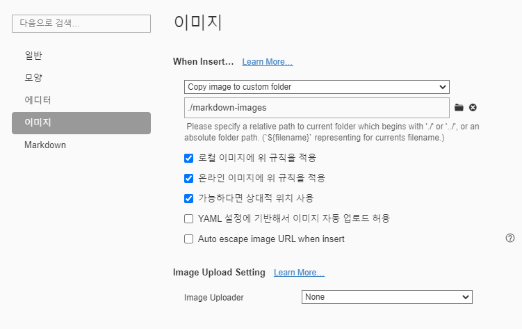

# CLI (command line interface)

명령줄 인터페이스

- cd 폴더명: 경로이동

- cd . : 현재폴더
- cd .. : 이전폴더
- mkdir 폴더명: 폴더생성
- touch 파일.확장자: 파일 생성
- git init: 저장소 생성
- git add. :  커밋할 목록에 변경사항 등록
- git commit -m 'First commit': 커밋명령어
- git status: 깃 저장소 상태확인 수정 등

- git log: 버전(이력)

# GUI (Graphic User Interface)

그래픽 유저 인터페이스


# 마크다운 문법

## 제목(Heading)

제목은 `#` 으로  `H1` ~ `H6` 까지 표현 가능

### 제목3

#### 제목 4

##### 제목 5

###### 제목6

## 목록

* 목록은
* 순서가 없는 목록이
* 있다.
  * Tab을 통해 목록 수준 표현 가능
  * 엔터
* shift + tab

1. 순서가
2. 있는
3. 목록

* 섞어서 가능

  1. 안녕

  * 섞기


## 코드블록

```python
print('hello!')
# 주석
```

```html
<!-- 주석 -->
<h1>
    안녕
</h1>
```

## 링크

외부 URL: [google](http://google.com)

특정 파일의 상대경로: [README](./README.md)

## 이미지파일




- 위와 같이 절대경로로 표현할 경우. github 등에서 파일이 존재하지 않아 이미지 출력이 어려움
- typora의 설정을 통해 해결

## 표

| 이름   | 나이 | 비고 |
| ------ | ---- | ---- |
| 홍길동 | 28   |      |
| 김철수 | 22   |      |
|        |      |      |

## 기타문법

*기울임 이텔릭체*

**볼드체**

~~취소선~~

`인라인코드블록`